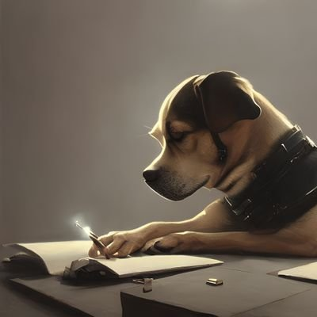

# Dog das Citações

## funcionamento

O [@dog_das_citações](https://twitter.com/el_dog_citador) posta rotineiramente citações de diversos autores populares com imagens junto com imagens relacionadas ao fundo

Isso é feito atrvéz de uma busca no site [Pensador.com](https://www.pensador.com/) junto de um trabalho com a api geradora de imagens da [OpenAi](https://platform.openai.com/docs/guides/images/image-generation-beta)

Muito do código daqui foi inspirado em outro projéto meu, o [auto-pvr](https://github.com/luisArthurRodriguesDaSilva/auto-pvr), que também trabalha com imagens e textos

Através de um container rodando num servidor da [railway](https://railway.app/),informo que o Dog das Citações ja está em produção :rocket: :rocket: :tada: :fireworks:

### A seguir exemplos dele funcionando

Veja mais [aqui](https://twitter.com/el_dog_citador)
