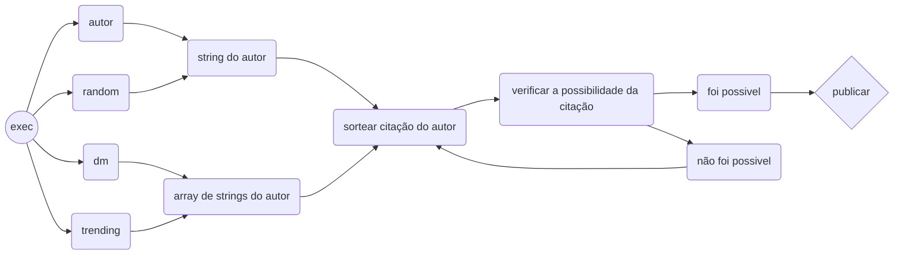

<h1 align="center"> el_dog_citador </h1>

  

    O <a href="https://twitter.com/el_dog_citador" >@el_dog_citador</a> funciona através de uma lista de autores enviados pelos seguidores

 
A cada dia são sorteados 5 desses autores e deles são sorteadas as citações

    
Para adicionar um nome nessa lista de sorteio um seguidor deve mandar uma mensagem na dm com seguinte modelo

  <h5>Autor: nome do autor</h5>
    <h4> Observe os exemplos a seguir: </h4>
  
                                                           
    
     
        
  

  <h1 >exemplos de twets:</h1>
  
  
  
  

<h1>Diagrama do funcionamento</h1>

